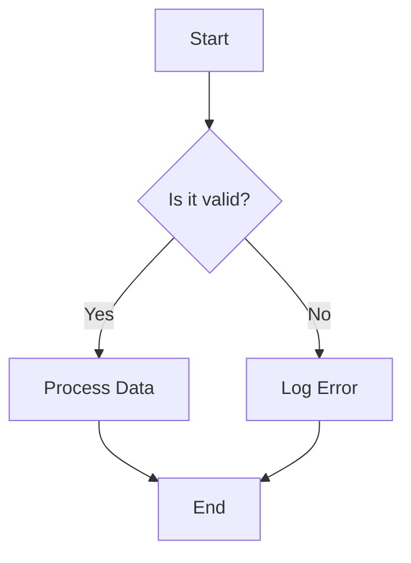
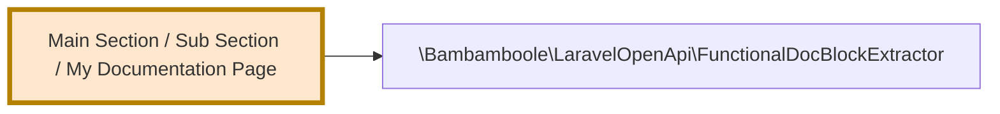

# My Documentation Page

Source: `Bambamboole\LaravelOpenApi\Commands\GenerateMKDocsCommand`
{:.page-subtitle}

This is the main description of the functionality. It can span multiple
lines, and paragraphs are created automatically.

You can use standard Markdown formatting like **bold** and `inline code`.

## Section Headings

Use Markdown headings (starting with `#`) to structure your document. The
script will automatically "demote" them to fit the page structure, so you'll
see this render as an `<h2>` on the page.

Here is a list of key features:

- **Feature One:** Does something important.
    - You can have nested bullets.
    - The script correctly preserves the indentation.
- **Feature Two:** Handles another case.

### Mermaid Diagrams

You can embed Mermaid charts for diagrams and flowcharts. The script is
smart enough to handle pasted code with different indentation.

The script will correctly render this as a visual diagram.

* @nav Main Section / Sub Section / My Documentation Page

## Building Blocks Used

This functionality is composed of the following reusable components:

* \Bambamboole\LaravelOpenApi\FunctionalDocBlockExtractor (Not documented)

### Composition Graph

## Further reading

* [https://link-to-relevant-docs.com](https://link-to-relevant-docs.com)
* [A pre-formatted link](https://another-link.com)
